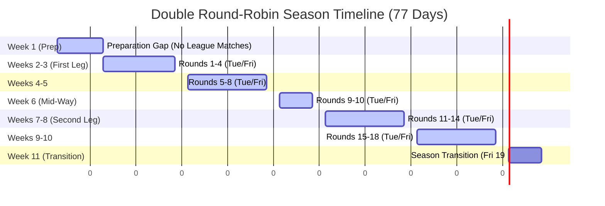

# Calendar & Server Ticks System

Reference: [game-summary.md](../game-summary.md#22-calendar--server-ticks), [league-system.md](league-system.md)

Purpose: Document the weekly schedule, automated event sequences, daily/weekly server ticks, and the timeline of a league season.

---

## Weekly Server Tick Schedule

The game world operates on automated server ticks executed at scheduled times. These ticks process progression, economy, maintenance, and competitive matches. All ticks are executed in the Kingdom's local timezone.

| Day | Time | Event / Tick | Action Details |
|:---|:---|:---|:---|
| **Daily** | 00:00 | **Daily Reset & Maintenance** | Cleanup stale match formations, fan club evolution, expired marketplace listings, completed HQ facility upgrades, hero/trainer aging, and season pre-creation on Monday of Week 11. |
| **Daily** | 03:30 | **Inactive Registration Cleanup** | Remove team assignments and delete unverified player accounts older than 1 day. |
| **Daily** | 03:45 | **Inactive Player Cleanup** | Release teams from verified players inactive for 28+ days. |
| **Daily** | 04:00 | **Fatigue & Form Recovery** | Recovery tick for hero fatigue and form (passive restoration). |
| **Tuesday** | 18:00 | **League Match (Mid-Week)** | Process scheduled mid-week league fixtures. **Currently implemented:** home-team arena ticket revenue. **Planned (Phase 5):** combat resolution, match XP, post-match fatigue/form/morale/aging. |
| **Thursday** | 10:00 | **Weekly Training** | Process active trainer assignments. Calculate stat gains (non-linear formulas, raw x10 scaling) and apply to heroes. |
| **Friday** | 18:00 | **League Match (End-Week)** | Process scheduled end-week league fixtures. **Currently implemented:** home-team arena ticket revenue. **Planned (Phase 5):** combat resolution, match XP, post-match fatigue/form/morale/aging. |
| **Friday** | 19:00 | **Season Transition** *(Week 11 only)* | Run season resolution service: finalize standings, distribute tier promotion/relegation rewards, execute team transfers (promotions/relegations), initialize the next season. |
| **Sunday** | 09:30 | **Arena Adaptation** | Apply pending headquarters arena adaptation changes and manage weekly adaptation lock cycles. |
| **Weekly** | Sun 23:59 | **Weekly Reset** | Reset summoning chamber cooldowns, process HQ maintenance fees, **Royal Treasury distribution**, facility downgrade lock expiry, and weekly financial-crisis checks. |

---

## Season Lifecycle Timeline

Based on a standard 10-team league group playing a **double round-robin** tournament (each team plays every other team twice: once Home, once Away), the season requires **18 rounds** of matches. 

To provide players with time to prepare rosters, adjust strategies, and play friendly matches:
- **Week 1 (Preparation Gap):** No league matches are scheduled. Players can recruit heroes, build formations, trade on the marketplace, upgrade headquarters facilities, and schedule friendly/practice matches.
- **Weeks 2 to 10 (League Matches):** 18 rounds of league matches are played at a pace of **2 matches per week** (Tuesday and Friday).
- **Week 11 (Post-Season Transition):** League matches are completed. The week is used for rest, standings review, and the **Season Transition** on Friday at 19:00.

Consequently, the entire season spans **11 weeks (77 days)**.

> [!NOTE]
> The default `season_length` of 28 days (4 weeks) is extended to **77 days** to accommodate the preparation week, 18 rounds of league play, and the post-season transition phase in Week 11.

### Chronological Season Timeline

- **Week 1:**
  - No league matches. Reserved for recruitment, training, trade, and friendly matches.
- **Weeks 2 to 10:**
  - **Tuesday 18:00:** Mid-week match (Odd rounds: 1, 3, 5, 7, 9, 11, 13, 15, 17)
  - **Friday 18:00:** End-week match (Even rounds: 2, 4, 6, 8, 10, 12, 14, 16, 18)
- **Week 11:**
  - **Tuesday 18:00:** Rest day / Standings review
  - **Friday 18:00:** Rest day / Final preparation
  - **Friday 19:00:** **Season Transition** (resolution of promotions, relegations, rewards, and preparation for Season N+1)

---

## Match Scheduling & Venue Alternation

To ensure fair scheduling using **Berger's Algorithm** (double round-robin), match fixtures are generated before the season starts.

### Weekly Home/Away Balance Rule
For weeks 2 to 10 (which contain exactly 2 rounds per week):
- Each team is scheduled to play **exactly 1 Home match** and **exactly 1 Away match** per week.
- This prevents a team from playing two consecutive home or away matches within the same week, balancing arena ticket revenue and home field advantages.
- Since 18 is an even number, every team will have played exactly **9 Home** matches and **9 Away** matches by the end of the season.

*For implementation details of the fixture scheduling algorithm, see [League System - Match Scheduling](league-system.md#match-scheduling-and-processing).*

---

## Technical Architecture & Tick Runner

### 1. Database Persistence (`KingdomTickLog`)

To guarantee that scheduled ticks are run exactly once (idempotency), no ticks are missed during system downtime, and failures are isolated, the status of each tick execution is logged in the database:

- **Entity**: `App\Entity\Kingdom\KingdomTickLog`
- **Table**: `kingdom_tick_log`
- **Fields**:
  - `id` (INT, Primary Key)
  - `kingdom_id` (INT, Foreign Key to `kingdom`, NOT NULL)
  - `team_id` (INT, Foreign Key to `team`, Nullable) - Indicates a team-scoped tick.
  - `fixture_id` (INT, Foreign Key to `league_fixture`, Nullable) - Indicates a match-scoped tick.
  - `tickType` (VARCHAR(30) / Enum: `daily_reset`, `inactive_registration_cleanup`, `inactive_player_cleanup`, `fatigue_recovery`, `weekly_training`, `league_match`, `season_transition`, `race_optimization`, `weekly_reset`)
  - `scheduledAt` (DATETIME, UTC, NOT NULL) - The scheduled real-world timestamp when the tick should have executed.
  - `status` (VARCHAR(15) / Enum: `pending`, `processing`, `completed`, `failed`)
  - `errorMessage` (TEXT, Nullable)
  - `executedAt` (DATETIME, UTC) - The real-world timestamp when processing actually ran.
- **Constraints**: Unique constraint on `[kingdom_id, tick_type, scheduled_at, team_id, fixture_id]`.

### 2. Tick Runner Command (`app:ticks:run`)

A background cron job triggers `bin/console app:ticks:run` periodically (e.g. every minute).
For each active Kingdom:
1. It queries completed `KingdomTickLog` rows to find the last completed scheduled timestamp ($t_{last}$) for each tick type and scope combination. If no log entry exists, it defaults to the `season_start_date`.
2. It generates all scheduled occurrences of that tick type between $t_{last}$ (exclusive) and `now` (inclusive) using the Weekly Server Tick Schedule.
3. For each pending occurrence, it schedules `'pending'` tick logs based on the tick type's scope:
   - **Team-scoped** (`WeeklyTraining`, `WeeklyReset`, `RaceOptimization`, `FatigueRecovery`, `InactivePlayerCleanup`, `DailyReset`): Schedules a separate log entry for each active team.
   - **Match-scoped** (`LeagueMatch`): Queries all scheduled fixtures in the kingdom at that time, and schedules a separate log entry for each fixture.
   - **Kingdom-scoped** (`SeasonTransition`, `InactiveRegistrationCleanup`, and the Royal Treasury distribution part of `WeeklyReset`): Schedules a single log entry.
4. If new ticks are scheduled or existing pending ticks are found, it dispatches a single `ProcessKingdomTicksMessage(kingdomId)` to Symfony Messenger.

### 3. Chronological, Parallel & Guided Orchestration Flow

Within the message handler (`ExecuteSingleTickHandler`) and the orchestrator (`KingdomTickOrchestrator`), ticks are executed in a parallel, step-by-step guided model:

1. **Orchestration Kickstart**:
   - The cron command `app:ticks:run` schedules pending ticks and calls `KingdomTickOrchestrator->orchestrate($kingdom)`.
   - The orchestrator acquires a database-level `PESSIMISTIC_WRITE` lock on the `Kingdom` entity. This lock acts as a synchronization barrier, ensuring only one worker or process can transition the pipeline to the next step at any time.

2. **Step Discovery & Parallel Dispatching**:
   - Under the lock, the orchestrator checks if the pipeline is blocked by any `failed` ticks or if any ticks are currently `processing`. If so, it halts.
   - It finds the oldest `scheduledAt` timestamp that has `pending` ticks.
   - At that timestamp, it finds the highest priority (lowest priority number) tick type group. Priorities are defined as:
     1. **Priority 2**: `WeeklyTraining`
     2. **Priority 3**: `LeagueMatch`
     3. **Priority 4**: `SeasonTransition`
     4. **Priority 5**: `FatigueRecovery`
     5. **Priority 6**: Resets/Cleanups (`DailyReset`, `WeeklyReset`, `RaceOptimization`, `InactiveRegistrationCleanup`, `InactivePlayerCleanup`)
   - It fetches all pending ticks belonging to this specific `[scheduledAt, priority]` group (e.g., all team training ticks or all fixtures in a match round) and dispatches them as separate `ExecuteSingleTickMessage` messages. These run concurrently across all available Messenger workers.

3. **Atomic Acquisition & Execution**:
   - When a worker consumes `ExecuteSingleTickMessage($tickLogId)`, it runs an atomic database update to change the tick status from `'pending'` to `'processing'`. If 0 rows are affected, another worker claimed it first, and it exits safely.
   - It executes the specific scoped tick within a transaction:
     - **Team-scoped**: Runs NPC simulation, training, resets, or fatigue recovery only for that team.
     - **Match-scoped**: Simulates tactics for both teams, pays arena ticket revenue, resolves the match, and cleans up temporary formations only for that fixture.
     - **Kingdom-scoped**: Resolves shared systems (e.g. treasury distribution or season transition).
   - If execution succeeds, the tick is marked `'completed'` and the transaction commits.
   - If execution fails, the transaction is rolled back, the tick is marked `'failed'` (with the error message and trace saved in a separate transaction), and the handler exits. The orchestrator is **not** called, halting the pipeline.

4. **Barrier Synchronization (Fork-Join)**:
   - Upon successful completion of a tick, the handler calls `KingdomTickOrchestrator->orchestrate($kingdom)`.
   - The orchestrator acquires the `PESSIMISTIC_WRITE` lock on the `Kingdom` row.
   - It checks if there are any other `pending` or `processing` ticks in the current group.
     - If yes, it does nothing and exits (waiting for the remaining parallel workers to finish).
     - If no (this was the last tick in the group), it advances the pipeline by finding the next priority group (or next timestamp) and dispatching its ticks in parallel.

This architecture guarantees:
- **Fault Isolation**: If a tick fails, the pipeline halts safely, preventing subsequent dependent ticks from executing on a corrupt state.
- **Horizontal Scalability**: Independent ticks at the same priority step (e.g. training for 50 teams or resolving 10 fixtures) are processed concurrently across multiple workers.
- **No Concurrency Conflicts**: The pessimistic database lock on the `Kingdom` ensures that the transition between priority groups is perfectly serialized, preventing parallel workers from racing or duplicating dispatches.
- **Self-Healing**: If a worker crashes or a message is lost, the next cron run of `app:ticks:run` automatically invokes the orchestrator to resume the pipeline from the last completed step.

### 4. Messenger Integration & Queues

We configure three priority transports in `config/packages/messenger.yaml`:
- **`async_high`**: Immediate interactions (real-time friendly match combat simulation, immediate player action processing).
- **`async_medium`**: Scheduled tick processing (e.g. `ProcessKingdomTicksMessage`).
- **`async_low`**: Analytics, history logs, and non-blocking notifications.

---

## Friendly Matches (Practice)

Friendly matches are **non-competitive practice battles** scheduled by players outside the league fixture list. They serve these purposes:

| Aspect | Rule |
|--------|------|
| **When** | Any time during Week 1 (preparation gap) or between league rounds; typically scheduled from the Arena screen (UI planned) |
| **Cost** | No league points at stake; optional gold fee may apply when hosting (future) |
| **Rewards** | Reduced XP and no league standing impact; useful for testing formations |
| **Combat** | Uses the same combat engine as league matches once Phase 5 combat simulation is implemented |
| **Calendar** | Appear in the kingdom calendar feed with `type: friendly_match` when scheduling is implemented |
| **Scheduling API** | `POST /api/v1/arena/schedule-match` — planned; requires combat engine |

Until the combat engine exists, friendly matches are documented only — no match resolution runs during ticks.

